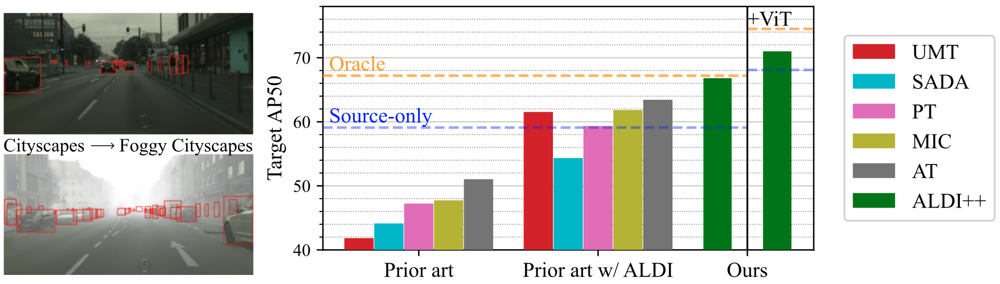

<!-- This is just for demonstration purposes to show how a finished publication page might look -->



**Align and Distill (ALDI) achieves state-of-the-art performance in domain adaptive object detection (DAOD) and provides a unified framework for fair comparison.**

We show:

1.  Inconsistent implementation practices give the appearance of steady progress in DAOD (left bars); reimplementation and fair comparison with ALDI shows less difference between methods than previously reported (middle bars).
2.  A fairly constructed source-only model (blue line) outperforms many existing DAOD methods, indicating less progress has been made than previously reported; and a proper oracle (orange line) outperforms _all_ existing methods, in contrast to previously-published results.
3.  Our proposed method ALDI++ (green bars) achieves state-of-the-art performance on DAOD benchmarks such as Cityscapes → Foggy Cityscapes and is complementary to ongoing advances in object detection like VitDet.

* * *

Abstract
--------

Object detectors often perform poorly on data that differs from their training set. Domain adaptive object detection (DAOD) methods have recently demonstrated strong results on addressing this challenge.

Unfortunately, we identify systemic benchmarking pitfalls that call past results into question and hamper further progress:

1.  Overestimation of performance due to underpowered baselines.
2.  Inconsistent implementation practices preventing transparent comparisons of methods.
3.  Lack of generality due to outdated backbones and lack of diversity in benchmarks.

We address these problems by introducing:

1.  A unified benchmarking and implementation framework, [Align and Distill (ALDI)](https://github.com/justinkay/aldi), enabling comparison of DAOD methods and supporting future development.
2.  A fair and modern training and evaluation protocol for DAOD that addresses benchmarking pitfalls.
3.  A new DAOD benchmark dataset, [CFC-DAOD](https://github.com/visipedia/caltech-fish-counting/tree/main/CFC-DAOD), enabling evaluation on diverse real-world data.
4.  A new method, ALDI++, that achieves state-of-the-art results by a large margin. ALDI++ outperforms the previous state-of-the-art by +3.5 AP50 on Cityscapes → Foggy Cityscapes, +5.7 AP50 on Sim10k → Cityscapes (where ours is the _only_ method to outperform a fair baseline), and +2.0 AP50 on CFC Kenai → Channel.

* * *

Align and Distill (ALDI): Unifying DAOD
---------------------------------------

Two methodological themes have dominated recent DAOD research: _feature alignment_ and _self-training/self-distillation_. We use these commonalities to motivate our unified framework, _Align and Distill (ALDI)_.


ALDI is a student-teacher framework for DAOD with three computation branches. At each training step (moving left to right and bottom to top):

1.  $B_{src}$ labeled source images $x_{src}$ are sampled, transformed according to $T_{src}$, and passed to a student model $\theta_{stu}$, where supervised loss $L_{sup}$ is computed using ground truth labels $y_{src}$.
2.  $B_{tgt}$ unlabeled target images $x_{tgt}$ are sampled, transformed according to $T_{tgt}$, and passed to the student to obtain predictions $p_{tgt}$. Alignment objectives $L_{align}$ are computed using $x_{src}$ and $x_{tgt}$.
3.  The same unlabeled target data $x_{tgt}$ is weakly transformed and passed to a teacher model $\theta_{tch}$, and postprocessed to obtain teacher preds $\hat{p}_{tgt}$. Distillation loss $L_{distill}$ is computed between teacher and student predictions. A stop gradient (SG) is used on the teacher model, and the teacher is updated every training step to be the EMA of the student's weights.

To demonstrate the broad applicability of our framework, we re-implement five recent DAOD methods on top of ALDI using the following settings. The methods are: [SADA](https://link.springer.com/article/10.1007/s11263-021-01447-x), [Probabilistic Teacher (PT)](https://arxiv.org/abs/2206.06293), [Unbiased Mean Teacher (UMT)](https://arxiv.org/abs/2003.00707), [Masked-Image Consistency (MIC)](https://arxiv.org/abs/2212.01322), and [Adaptive Teacher (AT)](https://arxiv.org/abs/2111.13216).


**Burn-in:** fixed duration (Fixed), our approach (Ours, see ALDI++ below). **Augs. $T_{src}, T_{tgt}$:** Random flip (F), multi-scale (M), crop & pad (CP), color jitter (J), cutout (C), MIC. ${\frac{1}{2}}$: augs used on half the images in the batch. **$\frac{B_{tgt}}{B}$:** Target-domain portion of minibatch of size $B$. **Postprocess:** Processing of teacher preds before distillation: sigmoid/softmax (Sharpen), sum class preds for pseudo-objectness (Sum), conf. thresholding (Thresh), NMS. **$L_{distill}$:** Distillation losses: hard pseudo-labels (Hard), continuous targets (Soft). **$L_{align}$:** Feature alignment losses: image-level adversarial (Img), instance-level adversarial (Inst), image-to-image translation (Img2Img). **AP50$_{FCS}$:** Performance on Foggy Cityscapes. $^\dagger$: settings used in ALDI implementation (last column) but not in the original implementation (second-to-last column). $^{at}$: source-only and oracle results sourced from AT.

* * *

ALDI++: Improving DAOD
----------------------

We propose two novel enhancements to the _Align and Distill_ approach, resulting in a new method ALDI++. These enhancements lead to state-of-the-art results.

#### Robust Burn-In

First we propose a new ''burn-in'' strategy for pretraining a teacher model $\theta_{tch}$ on source-only data $X_{src}$. A key challenge in student-teacher methods is improving target-domain pseudo-label quality. We point out that psuedo-label quality in the early stages of self-training is largely determined by the _out-of-distribution (OOD) generalization_ capabilities of the initial teacher model $\theta^{init}_{tch}$, and thus propose a training strategy aimed at improving OOD generalization during burn-in. We add strong data augmentations including random resizing, color jitter, and random erasing, and keep an EMA copy of the model during burn-in.


Our proposed burn-in strategy improves AP50$_{FCS}$ by +4.7 and reduces training time by 10x compared to no burn-in.

#### Multi-task Soft Distillation


Most prior work utilizes confidence thresholding and non-maximum suppression to generate ''hard'' pseudo-labels from teacher predictions $\\hat{p}_{tgt}$. However in object detection this strategy is sensitive to the confidence threshold chosen, leading to both false positive and false negative errors that harm self-training. We take inspiration from the knowledge distillation literature and propose instead using ''soft'' distillation losses—_i.e.,_ using teacher prediction scores as targets without thresholding—allowing us to eliminate the confidence threshold hyperparameter.

We distill each task of Faster R-CNN—Region Proposal Network localization ($rpn$) and objectness ($obj$), and Region-of-Interest Heads localization ($roih$) and classification ($cls$)—independently. At each stage, the teacher provides distillation targets for the same set of input proposals used by the student—_i.e.,_ anchors $A$ in the first stage, and _student_ region proposals $p^{rpn}_{tgt}$ in the second stage. Please see our paper for more implementation details.

* * *

The CFC-DAOD Dataset
--------------------

DAOD benchmarks have focused largely on urban driving scenarios with synthetic distribution shifts (_e.g.,_ [Cityscapes](https://www.cityscapes-dataset.com/), [Foggy Cityscapes](https://www.cityscapes-dataset.com/), [Sim10k](https://fcav.engin.umich.edu/projects/driving-in-the-matrix)). We argue a greater diversity of benchmarks is needed to determine whether DAOD methods are broadly applicable and to ensure we are not overfitting to one particular domain.


We introduce an extension to the [Caltech Fish Counting Dataset](https://github.com/visipedia/caltech-fish-counting)—a domain generalization benchmark sourced from a real-world environmental monitoring application—with new data to enable DAOD. We call our new benchmark [CFC-DAOD](https://github.com/visipedia/caltech-fish-counting/tree/main/CFC-DAOD).

CFC-DAOD focuses on detecting fish (white bounding boxes) in sonar imagery under domain shift caused by environmental differences between the training location (Kenai) and testing location (Channel). Our dataset contains 168k bounding boxes in 29k frames sampled from 150 new videos captured over two days from 3 different sonar cameras on the Channel river, enabling DAOD experiments. Our dataset is substantially larger than existing DAOD benchmarks, and we show that the ranking of DAOD methods is not consistent across datasets, thus the research community will benefit from another point of comparison.

* * *

A New Experimental Protocol for DAOD
------------------------------------

To measure DAOD methods' performance, researchers use _source-only models_ and _oracle models_ as points of reference. Source-only models—sometimes also referred to as _baselines_—are trained with source-domain data only, representing a lower bound for performance without domain adaptation. Oracle models are trained with _supervised_ target-domain data, representing a fully-supervised upper bound. The goal in DAOD is to close the gap between source-only and oracle performance without target-domain supervision.

We find that in prior work,source-only and oracle models are consistently constructed in a way that does not properly isolate domain-adaptation-specific components, leading to misattribution of performance improvements.


The goal of DAOD is to develop adaptation techniques that use unlabeled target-domain data to improve target-domain performance. Thus, in order to properly isolate _adaptation-specific_ techniques, **any technique that does not need target-domain data to run should also be used by source-only and oracle models.** In our case, this means that source-only and oracle models should also utilize the same strong augmentations and EMA updates as DAOD methods. We show that including these components significantly improves both source-only and oracle model performance (+7.2 and +2.6 AP50 on Foggy Cityscapes, respectively). This has significant implications for DAOD research: because source-only and oracle models have not been constructed with equivalent components, performance gains stemming from better generalization have until now been _misattributed_ to DAOD. With properly constructed source-only and oracle models, the gains from DAOD are much more modest.

#### Modernizing Architectures

Prior art in DAOD has used older backbones (_e.g.,_ VGG-16) in order to compare to previously-published results. The underlying assumption is that methods will perform equivalently across backbone architectures. By reimplementing methods in ALDI, we are able to upgrade to a modern detector framework and backbone, and show that in fact the _ranking of methods changes across benchmarks and architectures_, revealing that previously-published results may be uninformative for practitioners using modern architectures.

* * *

Results
-------


We provide a fair comparison of ALDI++ with five existing state-of-the-art approaches by upgrading them to use the ALDI framework. We see that some prior methods continue to provide benefit on top of a modern architecture but others lag behind modern source-only models. ALDI++ outperforms prior work on all datasets studied by a significant margin: +3.5 AP50 on CS → FCS, +5.7 AP50 on Sim10k → CS, and +2.0 AP50 on CFC Kenai → Channel. Notably, ALDI++ is the _only_ method to outperform a source-only model on Sim10k → CS.

Our framework, dataset, and state-of-the-art method offer a critical reset for DAOD and provide a strong foundation for future research.

* * *

Acknowledgements
----------------

This material is based upon work supported by: NSF CISE Graduate Fellowships Grant #2313998, MIT EECS department fellowship #4000184939, MIT J-WAFS seed grant #2040131, and Caltech Resnick Sustainability Institute Impact Grant ''Continuous, accurate and cost-effective counting of migrating salmon for conservation and fishery management in the Pacific Northwest.'' Any opinions, findings, and conclusions or recommendations expressed in this material are those of the authors and do not necessarily reflect the views of NSF, MIT, J-WAFS, Caltech, or RSI. The authors acknowledge the MIT SuperCloud and Lincoln Laboratory Supercomputing Center for providing HPC resources. We also thank the Alaska Department of Fish and Game for their ongoing collaboration and for providing data, and Sam Heinrich, Neha Hulkund, Kai Van Brunt, and Rangel Daroya for helpful feedback.

BibTeX
------

    @misc{kay2024align,
          title={Align and Distill: Unifying and Improving Domain Adaptive Object Detection}, 
          author={Justin Kay and Timm Haucke and Suzanne Stathatos and Siqi Deng and Erik Young and Pietro Perona and Sara Beery and Grant Van Horn},
          year={2024},
          eprint={2403.12029},
          archivePrefix={arXiv},
          primaryClass={cs.CV}
    }

Code Example
------
```python
import torch

from detectron2.structures.boxes import Boxes
from detectron2.structures.instances import Instances


class PseudoLabeler:
    def __init__(self, model, threshold):
        self.model = model
        self.threshold = threshold

    def __call__(self, unlabeled_weak, unlabeled_strong):
        return pseudo_label_inplace(self.model, unlabeled_weak, unlabeled_strong, self.threshold)

def pseudo_label_inplace(model, unlabeled_weak, unlabeled_strong, threshold):
    with torch.no_grad():
        # get predictions from teacher model on weakly-augmented data
        # do_postprocess=False to disable transforming outputs back into original image space
        was_training = model.training
        model.eval()
        teacher_preds = model.inference(unlabeled_weak, do_postprocess=False)
        if was_training: model.train()

        # postprocess pseudo labels (thresholding)
        teacher_preds, _ = process_pseudo_label(teacher_preds, threshold)
        
        # add pseudo labels back as "ground truth"
        add_label(unlabeled_weak, teacher_preds)
        if unlabeled_strong is not None:
            add_label(unlabeled_strong, teacher_preds)

# Modified from Adaptive Teacher ATeacherTrainer:
# - Remove RPN option
def process_pseudo_label(proposals, cur_threshold):
    list_instances = []
    num_proposal_output = 0.0
    for proposal_bbox_inst in proposals:
        proposal_bbox_inst = process_bbox(
            proposal_bbox_inst,
            thres=cur_threshold, 
        )
        num_proposal_output += len(proposal_bbox_inst)
        list_instances.append(proposal_bbox_inst)
        
    num_proposal_output = num_proposal_output / len(proposals)
    return list_instances, num_proposal_output

# Modified from Adaptive Teacher ATeacherTrainer threshold_bbox:
# - Remove RPN option
# - Put new labels on CPU (for compatibility with Visualizer, e.g.)
def process_bbox(proposal_bbox_inst, thres=0.7):
    valid_map = proposal_bbox_inst.scores > thres

    # create instances containing boxes and gt_classes
    image_shape = proposal_bbox_inst.image_size
    new_proposal_inst = Instances(image_shape)

    # create box
    new_bbox_loc = proposal_bbox_inst.pred_boxes.tensor[valid_map, :]
    new_boxes = Boxes(new_bbox_loc)

    # add boxes to instances
    new_proposal_inst.gt_boxes = new_boxes.to("cpu")
    new_proposal_inst.gt_classes = proposal_bbox_inst.pred_classes[valid_map].to("cpu")
    new_proposal_inst.scores = proposal_bbox_inst.scores[valid_map].to("cpu")

    return new_proposal_inst

# From Adaptive Teacher ATeacherTrainer
def add_label(unlabled_data, label):
    for unlabel_datum, lab_inst in zip(unlabled_data, label):
        unlabel_datum["instances"] = lab_inst
    return unlabled_data
```